# Janv Database ERD

This ERD reflects the **current local migration schema** in `/Users/manojkumar/janv/migrations`. It is not a confirmed diagram of the original PrepInsta database. The original database is private; fields such as `collegeId`, assessment visibility, reports, and certificates were inferred only from observable frontend/API behavior.

## Current Schema ERD

```mermaid
erDiagram
    INSTITUTIONS ||--o{ USERS : contains
    INSTITUTIONS ||--o{ COURSES : owns
    INSTITUTIONS ||--o{ BATCHES : owns
    INSTITUTIONS ||--o{ BRANCHES : owns
    INSTITUTIONS ||--o{ ASSESSMENTS : owns
    INSTITUTIONS ||--o{ CERTIFICATES : issues
    INSTITUTIONS ||--o{ ASSESSMENT_INSTITUTION_VISIBILITY : grants
    INSTITUTIONS ||--o{ ASSESSMENT_PDF_REPORTS : owns

    USERS ||--o{ REFRESH_TOKENS : has
    USERS ||--o{ COURSES : teaches
    USERS ||--o{ QUESTION_BANKS : creates
    USERS ||--o{ ASSESSMENTS : creates
    USERS ||--o{ ATTEMPTS : makes
    USERS ||--o{ ENROLLMENTS : receives
    USERS ||--o{ LEADERBOARD_ENTRIES : ranks
    USERS ||--o{ CODE_SUBMISSIONS : submits
    USERS ||--o{ AUDIT_LOG : performs
    USERS ||--o{ WATCH_PROGRESS : records
    USERS ||--o{ RATINGS : gives
    USERS ||--o{ CERTIFICATES : receives

    COURSES ||--o{ ENROLLMENTS : has
    COURSES ||--o{ ASSESSMENTS : contains
    COURSES ||--o{ COURSE_VIDEOS : contains
    COURSES ||--o{ RATINGS : receives
    COURSES ||--o{ CERTIFICATES : supports

    COURSE_VIDEOS ||--o{ WATCH_PROGRESS : tracks

    QUESTION_BANKS ||--o{ QUESTIONS : contains
    QUESTIONS ||--o{ ASSESSMENT_QUESTIONS : links
    USERS ||--o{ ASSESSMENT_TEMPLATES : creates

    ASSESSMENTS ||--o{ ASSESSMENT_QUESTIONS : contains
    ASSESSMENTS ||--o{ ASSESSMENT_SECTIONS : contains
    ASSESSMENTS ||--o{ ATTEMPTS : receives
    ASSESSMENTS ||--o| ASSESSMENT_PASSCODES : protects
    ASSESSMENTS ||--o{ LEADERBOARD_ENTRIES : ranks
    ASSESSMENTS ||--o{ ASSESSMENT_PDF_REPORTS : generates
    ASSESSMENTS ||--o{ RATINGS : receives
    ASSESSMENTS ||--o{ ASSESSMENT_INSTITUTION_VISIBILITY : visible_to
    ASSESSMENTS ||--o{ ASSESSMENT_BATCH_VISIBILITY : visible_to

    ASSESSMENT_SECTIONS ||--o{ ASSESSMENT_QUESTIONS : orders
    ASSESSMENT_QUESTIONS }o--|| QUESTIONS : uses

    BATCHES ||--o{ ASSESSMENT_BATCH_VISIBILITY : receives

    ATTEMPTS ||--o{ PROCTORING_EVENTS : records

    CODING_PROBLEMS ||--o{ TEST_CASES : contains
    CODING_PROBLEMS ||--o{ CODE_SUBMISSIONS : receives

    CERTIFICATE_TEMPLATES ||--o{ CERTIFICATES : formats

    INSTITUTIONS {
        uuid id PK
        varchar name
        varchar code UK
        text logo_url
        boolean is_active
        timestamptz created_at
    }

    USERS {
        uuid id PK
        varchar email UK
        varchar password_hash
        varchar full_name
        user_role role
        uuid institution_id FK
        varchar department_legacy
        varchar batch_legacy
        varchar branch_legacy
        varchar class_legacy
        varchar roll_number
        boolean is_active
        timestamptz created_at
        timestamptz updated_at
    }

    REFRESH_TOKENS {
        uuid id PK
        uuid user_id FK
        varchar token_hash
        timestamptz expires_at
        timestamptz created_at
    }

    BATCHES {
        uuid id PK
        uuid institution_id FK
        varchar name
        integer year
        boolean is_active
    }

    BRANCHES {
        uuid id PK
        uuid institution_id FK
        varchar name
        boolean is_active
    }

    COURSES {
        uuid id PK
        uuid institution_id FK
        uuid faculty_id FK
        varchar title
        text description
        boolean is_published
        timestamptz created_at
    }

    ENROLLMENTS {
        uuid id PK
        uuid student_id FK
        uuid course_id FK
        timestamptz enrolled_at
    }

    COURSE_VIDEOS {
        uuid id PK
        uuid course_id FK
        varchar title
        text url
        integer duration_secs
        integer sort_order
    }

    WATCH_PROGRESS {
        uuid id PK
        uuid student_id FK
        uuid video_id FK
        integer watched_secs
        boolean completed
        timestamptz last_watched_at
    }

    RATINGS {
        uuid id PK
        uuid student_id FK
        uuid assessment_id FK
        uuid course_id FK
        double rating
        text feedback
        timestamptz created_at
    }

    ASSESSMENTS {
        uuid id PK
        uuid institution_id FK
        uuid course_id FK
        uuid faculty_id FK
        varchar title
        varchar test_code UK
        integer duration_mins
        integer total_marks
        double pass_percentage
        assessment_status status
        boolean is_published
        timestamptz start_time
        timestamptz end_time
        boolean is_proctoring
        boolean proctoring_enabled
        boolean is_hackathon
        boolean is_subscriber_only
        boolean is_in_library
    }

    ASSESSMENT_SECTIONS {
        uuid id PK
        uuid assessment_id FK
        varchar title
        varchar section_type
        integer duration_mins
        double default_marks
        double penalty_marks
        integer display_questions
        integer sort_order
    }

    QUESTION_BANKS {
        uuid id PK
        uuid faculty_id FK
        varchar title
        varchar subject
        timestamptz created_at
    }

    QUESTIONS {
        uuid id PK
        uuid bank_id FK
        question_type question_type
        text content
        jsonb options
        text explanation
        difficulty difficulty
        integer points
    }

    ASSESSMENT_QUESTIONS {
        uuid assessment_id PK, FK
        uuid question_id PK, FK
        uuid section_id FK
        integer sort_order
    }

    ATTEMPTS {
        uuid id PK
        uuid assessment_id FK
        uuid student_id FK
        timestamptz started_at
        timestamptz submitted_at
        double score
        double percentage
        boolean is_passed
        attempt_status status
        jsonb answers
    }

    ASSESSMENT_PASSCODES {
        uuid id PK
        uuid assessment_id FK, UK
        varchar passcode
        boolean is_active
    }

    LEADERBOARD_ENTRIES {
        uuid id PK
        uuid assessment_id FK
        uuid student_id FK
        integer rank
        double score
        double percentage
        integer time_taken_secs
    }

    ASSESSMENT_TEMPLATES {
        uuid id PK
        uuid faculty_id FK
        varchar title
        varchar category
        jsonb question_config
        boolean is_public
    }

    ASSESSMENT_INSTITUTION_VISIBILITY {
        uuid assessment_id PK, FK
        uuid institution_id PK, FK
    }

    ASSESSMENT_BATCH_VISIBILITY {
        uuid assessment_id PK, FK
        uuid batch_id PK, FK
    }

    CERTIFICATES {
        uuid id PK
        varchar certificate_number UK
        uuid student_id FK
        uuid institution_id FK
        uuid course_id FK
        uuid assessment_id FK
        uuid template_id FK
        varchar batch_legacy
        varchar branch_legacy
        varchar status
        text file_url
        jsonb metadata
        timestamptz issued_at
    }

    CERTIFICATE_TEMPLATES {
        uuid id PK
        uuid institution_id FK
        varchar name
        text template_html
        boolean is_default
    }

    ASSESSMENT_PDF_REPORTS {
        uuid id PK
        uuid assessment_id FK
        uuid institution_id FK
        varchar status
        text file_url
        timestamptz created_at
        timestamptz completed_at
    }

    PROCTORING_EVENTS {
        uuid id PK
        uuid attempt_id FK
        varchar event_type
        jsonb event_data
        timestamptz timestamp
    }

    CODING_PROBLEMS {
        uuid id PK
        uuid faculty_id FK
        varchar title
        text description
        difficulty difficulty
        boolean is_published
    }

    TEST_CASES {
        uuid id PK
        uuid problem_id FK
        text input
        text expected_output
        boolean is_sample
        integer sort_order
        integer points
    }

    CODE_SUBMISSIONS {
        uuid id PK
        uuid problem_id FK
        uuid student_id FK
        varchar language
        text source_code
        submission_status status
        integer score
        jsonb test_results
    }

    AUDIT_LOG {
        uuid id PK
        uuid user_id FK
        varchar action
        varchar entity_type
        uuid entity_id
        jsonb details
        varchar ip_address
        timestamptz created_at
    }

    FAQS {
        uuid id PK
        text question
        text answer
        varchar category
        integer sort_order
        boolean is_published
    }

    ASSESSMENT_CODE_SEQUENCE {
        text sequence_name PK
        bigint sequence_value
    }
```

## Important Accuracy Notes

The diagram contains conceptual entities that should be added or normalized, but are not currently separate tables in the migrations:

- `DEPARTMENTS` is conceptual. The current schema has `branches` plus legacy text fields on `users`.
- `LINKED_ASSESSMENTS` is conceptual. The actual relationship is represented through `assessment_questions`.
- `REPORTS` has no general report table; only `assessment_pdf_reports` exists.
- `SUPER_ADMIN`, `INSTITUTION_ADMIN`, `FACULTY`, and `STUDENT` are roles, not separate tables. The current enum contains `super_admin`, `faculty`, and `student`; institution-admin support must be decided and added if required.
- `ASSESSMENT_TEMPLATES` and `CERTIFICATE_TEMPLATES` are separate concepts.
- Batch and branch fields on certificates/users are currently text-based and are not foreign keys to `batches`/`branches`.
- Assessment visibility exists both as legacy arrays and normalized tables. One source of truth must be selected.

## Recommended Corrections Before Production

- [ ] Add a real `departments` table or formally rename/use `branches` as the canonical department model.
- [ ] Add `department_id` and `batch_id` foreign keys to students, or document why legacy text is retained.
- [ ] Add `institution_admin` to the role model if that role is required.
- [ ] Backfill `assessments.institution_id` and make it non-null after validation.
- [ ] Add institution ownership to all institution-scoped content tables.
- [ ] Add explicit creator/owner fields where reports and permissions require them.
- [ ] Remove or synchronize legacy visibility arrays.
- [ ] Add foreign keys for every conceptual relationship that is required by business rules.
- [ ] Add report-job persistence if PDF generation is asynchronous.
- [ ] Add tenant-scoped uniqueness for assessment test codes if codes are only unique within an institution.
- [ ] Verify all indexes against actual RDS query plans.
- [ ] Validate this ERD against the live approved RDS test schema using `information_schema` and `pg_catalog` queries.

## Original Schema Limitation

This is not a confirmed ERD of the original PrepInsta database. The original website exposes frontend/API concepts such as college/institution, batch, branch, users, assessments, reports, and certificates, but it does not expose its private PostgreSQL DDL. Exact original-table parity requires an authorized schema-only dump from the original system owner.
